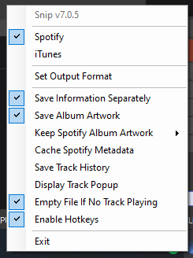

# Spotify Overlay Element

First of all, big thanks to the creator of [Snip](https://github.com/dlrudie/Snip). This would not be a thing without them. Note, this setup only works on Windows.

## Setup

1. Clone this repo
2. Run your music playing software (only works with Spotify and iTunes at the moment)
3. Run `Snip.exe`. Use the Taskbar icon to configure it in this way:

4. Run a live server and point it to the `index.html` in the project folder.
5. Customize the markup and styling if you wish.
6. Add a browser source to your OBS and customize it to your liking!
